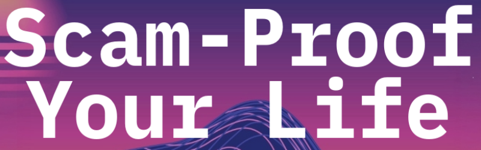

# Scam-Proof Your Life

This web application was originally created in March 2025 to promote the phishing and scam prevention event, **Scam-Proof Your Life**, hosted by the Northampton Community College Computer Club on **Monday, April 14, 2025**, at **4:00 PM** in **College Center 146**.

## About This Repository

This repository is a revamp of the original repository with a similar name and was created using Angular.

The original project was accessed through a QR code on a fake bake sale flyer, encouraging students and staff who fell for the mock scam to sign up for the event through a Google Form. Updated versions of this flyer, the event flyers, and the presentation are now included in the repository in the `materials` directory (original credits below). The fake bake sale flyer serves as a practical demonstration of how social engineering tactics can be used to gain trust and encourage interaction.

Feel free to use this as a reference if you are running your own phishing awareness event.

## Tech Stack

- Angular
- Netlify

## Prerequisites

Make sure you have [Node.js](https://nodejs.org/) and npm installed.

## Installation and Setup

Clone the repository and navigate to the project directory:

```bash
git clone https://github.com/NCC-Computer-Club-Projects/scam-proof-your-life.git
cd scam-proof-your-life
```

Install the project dependencies:

```bash
npm install
```

### Run Development Server

To start a local development server, run:

```bash
ng serve
```

The application will be available at:

```bash
http://localhost:4200/
```

### Build for Production

To build the project for production, run:

```bash
ng build
```

The build output will be generated in the `dist/` directory.

### Testing

To run tests, use:

```bash
ng test
```

## Credits

- Fake Bake Sale Flyer (originally by [Sushi](https://github.com/Sushi314))
- Scam-Proof Your Life Flyers 1 and 2 (originally by [Sushi](https://github.com/Sushi314) and [Tony](https://github.com/CyberWiz93))
- Scam-Proof Your Life Presentation (originally by [Sushi](https://github.com/Sushi314) and [Daniel Carbone](https://github.com/Dcarb697))

## License

The source code for this project is licensed under the MIT License.

Event materials in the `materials` directory may have separate attribution or usage requirements. See the Credits section for details.
